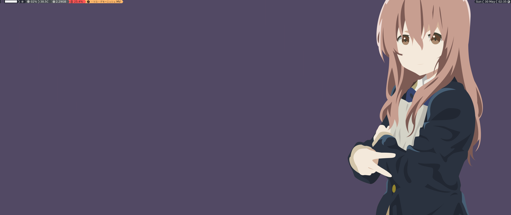
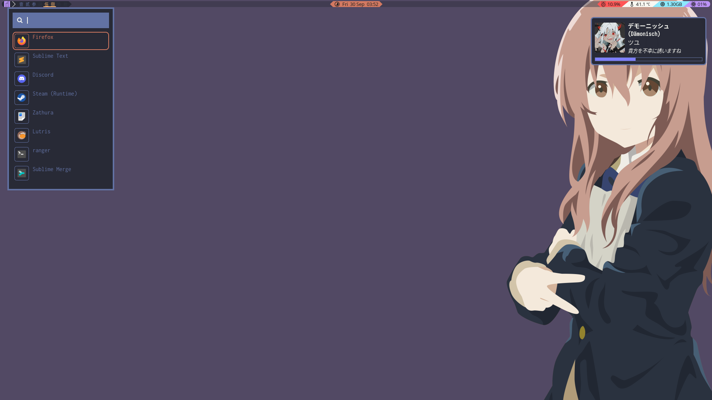
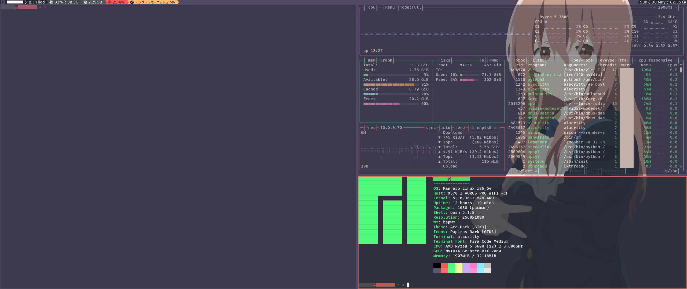
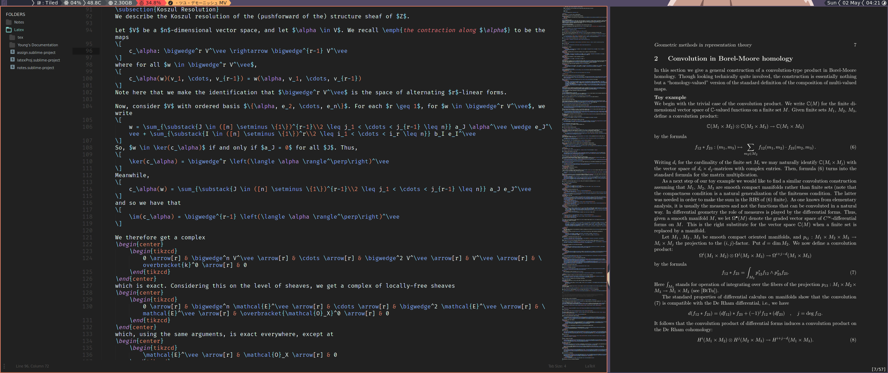
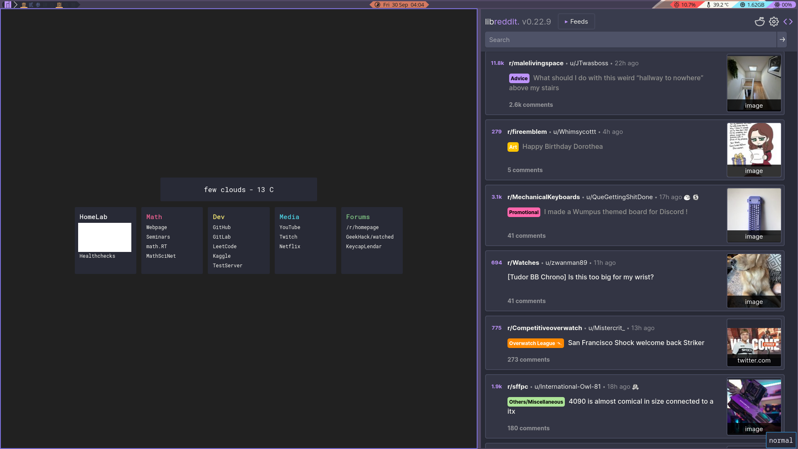

# dotfiles

## About
Personal dotfiles, almost all of which was assimilated and modified from all over the place.

| Item | Value |
| :--- | :---- |
| OS | Manjaro |
| DM | xfce4 |
| WM | Bspwm |
| Bar | Lemonbar |
| Compositor | picom |
| Shell | bash |
| Terminal | xfce4-terminal |
| Font | Inconsolata |
| Mono Font | Fira Code |
| Notification | xfce4-notifyd |
| Launcher | rofi, dmenu |
| Wallpaper | feh |
| Lock Screen | none |
| Text Editor | sublime test 3, nano |

## Installation
Will write a install script at some point...

## Screenshots

